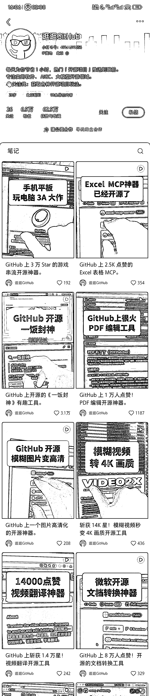

# 小红书 GitHub 项目介绍号的运营模式与复制要点

> 原文：[`www.yuque.com/for_lazy/wind/ykyg82s37hewghdp`](https://www.yuque.com/for_lazy/wind/ykyg82s37hewghdp)

作者： 小 Q

日期：2025-10-09

点赞数：**23**

* * *

正文：

小红书中的垂直小号，这种介绍 github 项目的，也就是说去关注一些 github 的榜单和一些开源社区就有源源不断的素材！
1.GitHub 是全球最大的开发者社区，宝藏项目无数，但信息过载严重。 - 绝大多数非资深开发者或普通用户，没有时间和精力去“淘金”。 - 这个账号抓住了 信息差”*这个永恒的痛点，扮演了****筛选者****和****搬运工****的角色。 2**.* *逛逛 GitHub」的成功，本质上是“降维打击”和“服务大众”的成功。** 它将一个精英社区的资源，以普惠的方式带给普通人。 3. 如果你想复制这种模式，关键在于： -  **找到一个你感兴趣或略懂，且信息更新快、有认知门槛的优质信息源。**  -  **将自己定位为“价值翻译官”和“信息过滤器”，而不是高深的专家。**  -  **始终坚持“用户视角”：这个东西对我（用户）有什么用？能解决什么具体问题？**  -  **形成稳定、标准化的内容产出节奏和风格。**

* * *

评论区：

亦仁 : 感谢分享，已中标

* * *

公众号懒人搜索，[懒人专属群分享](https://lazybook.fun/#/blog/group)