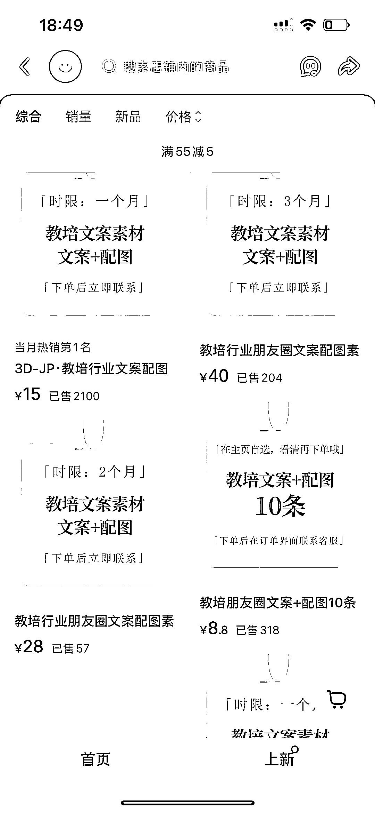
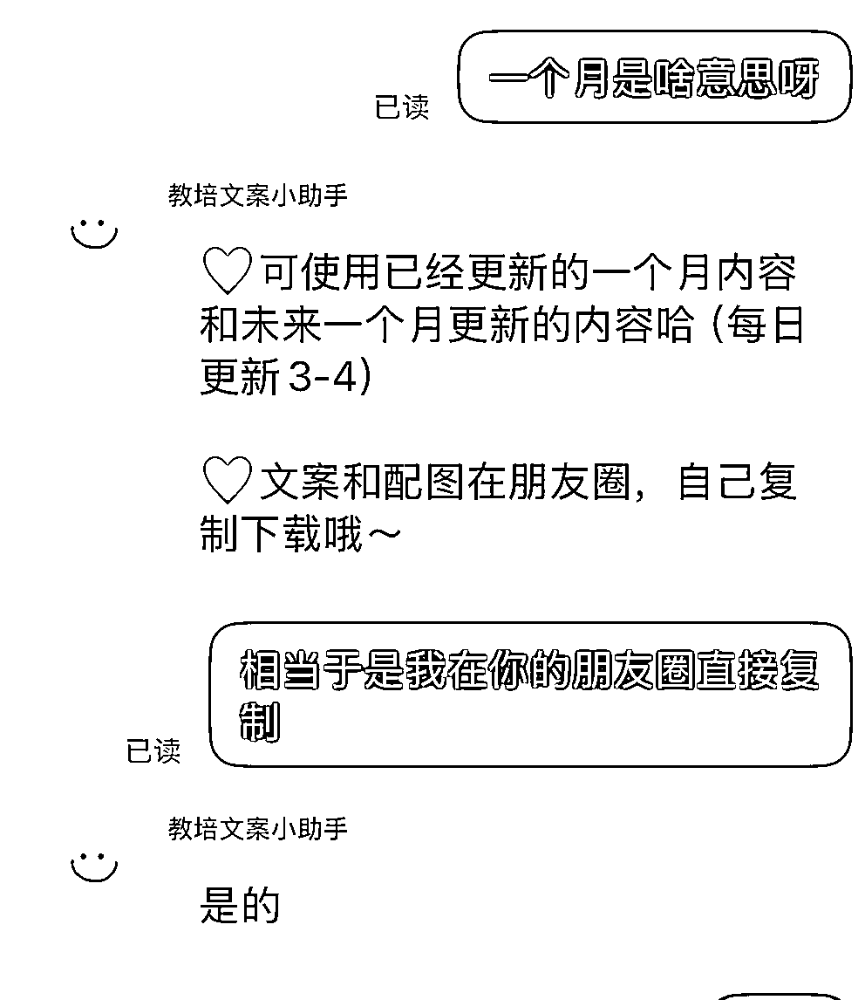

# 小红书朋友圈文案订阅服务：教培行业差异化变现方案及跨行业延伸方向

> 原文：[`www.yuque.com/for_lazy/wind/pegsy91aq3kf6i9q`](https://www.yuque.com/for_lazy/wind/pegsy91aq3kf6i9q)

作者： 大瑞

日期：2025-10-01

点赞数：**24**

* * *

正文：

小红书卖教培行业朋友圈文案 差异化的点是做成了订阅服务，一个月，三个月等等。下单后，把客户加到微信，让客户可以直接复制朋友圈的文案发布，确实也方便了客户。
这种差异化也很容易复购，一旦习惯性依赖，就会复购。其实除了做教培行业，也可以做其他需要大量发朋友圈的行业，比如美业，汽车，房产等。

* * *

评论区：

亦仁 : 感谢分享，已中标

摄影师海盐 : 这个账号叫什么名字呀？

大瑞 : 看第二张图

Mr.老吴 : 真有创意，关键还引流私域了

* * *

公众号懒人搜索，[懒人专属群分享](https://lazybook.fun/#/blog/group)