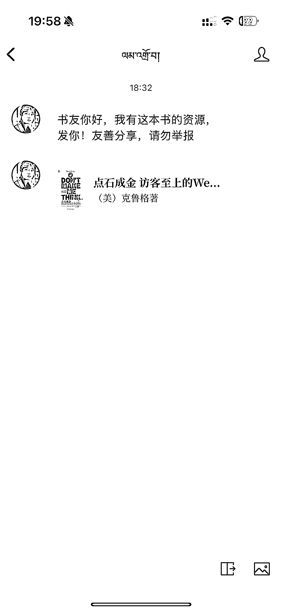
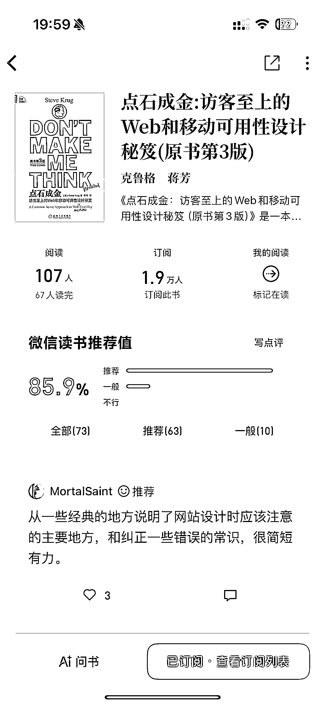
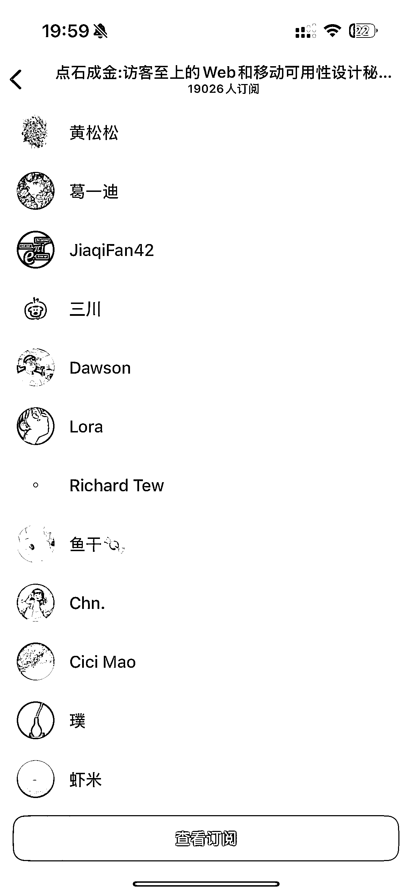

# 书籍订阅功能用户互助分享未上架资源现象观察

> 原文：[`www.yuque.com/for_lazy/wind/aeqhzqsa7v059pnl`](https://www.yuque.com/for_lazy/wind/aeqhzqsa7v059pnl)

作者： S

日期：2025-10-07

点赞数：**36**

* * *

正文：

我是微信使用用户，虽然微信很好用，但是也有不足的地方，那就是有缺书的情况。 今天发现了一个很有意思的事情，我点击订阅一本未上架的书籍。
有一位好心书友第一时间，直接给我发了一个未上架书籍的 pdf 文件。 后来我探究了一下，发现是在首页有一个订阅人群。 我大悟，这个群体很精准啊。
（但是一来不要有任何营销，联系先普通的问候，再进行自己的需求。）

* * *

评论区：

S : 微信读书

Sing : 后续可以怎么操作呢？拉私域或者其他？

亦仁 : 感谢分享，已中标

* * *

公众号懒人搜索，[懒人专属群分享](https://lazybook.fun/#/blog/group)