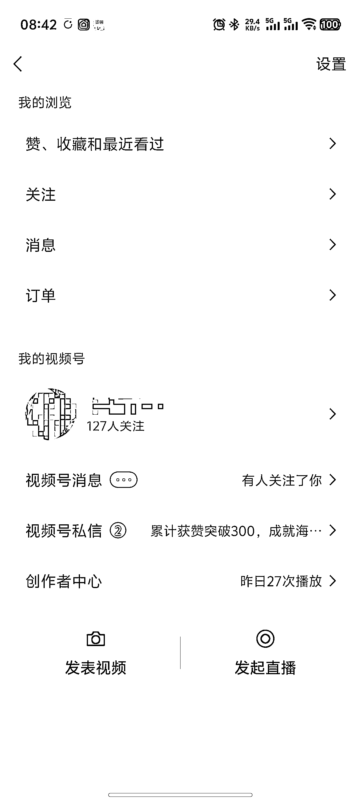

# 视频号儿女祝福内容 8 小时涨粉超百

> 原文：[`www.yuque.com/for_lazy/wind/ihcns3m8cxh12lsh`](https://www.yuque.com/for_lazy/wind/ihcns3m8cxh12lsh)

作者： 泽林

日期：2025-10-04

点赞数：**57**

* * *

正文：

分享一个视频号涨粉很猛的玩法，两个视频立省 70[得意]
这两天在测视频号带货，买有效粉 100 个要六七十，所以我就靠以前刷风向标的中老年祝福号玩法，试了试这个“儿女祝福”
实测非常猛，图一是对标账号，图二图三是我测试的。今天凌晨我测了第一条，然后早上起来发了第二条
第一条到早上有 3000 播放，涨 40 粉，第二条直接一小时 3000 播放，涨 70 粉。基本上总花时间 8 小时破百粉。 一开始是测的 ai 生成
祝福视频，但是效果不理想。 这个儿女祝福视频的操作流程就是：在抖音等平台找 10 秒内的花海视频素材，注意：在搜的时候会出现很多 AI
生成的花海，这里尽量选择实拍的。然后找到一份文案再
AI 仿写几份，直接添加到字幕上去就行。一个视频就做好了，两分钟一条。这里我主要是为了涨粉开播，没有开原创，不过开不开应该影响不大。
生财风向标真的很有用，看过了可能会忘记，但总有一天想起然后用上，发现真的很有用。 而且这种方式涨粉是安全的有效真人粉。
ps：写风向标的时候又涨了 20 个[憨笑]

* * *

评论区：

风益 : 牛逼，明天去测试下

泽林 : 更新下数据，已经 1330 关注了[呲牙]

榆烁 : 牛逼 昨晚起的号，测试效果如下，还有很多玩法，在探索优化

亦仁 : 感谢分享，已中标

泽林 : [强]

geekfeng : 变现渠道有哪些？效果怎样？

空 : 厉害的啊，我也去试试看

HY🍂 : 你好呀，这个我想好好请教一下，能否教教我

* * *

公众号懒人搜索，[懒人专属群分享](https://lazybook.fun/#/blog/group)