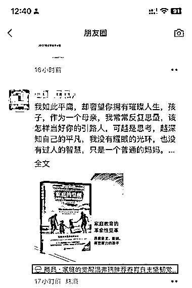
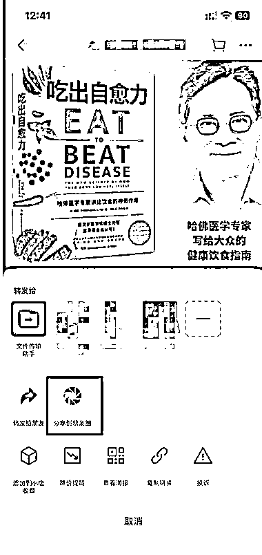
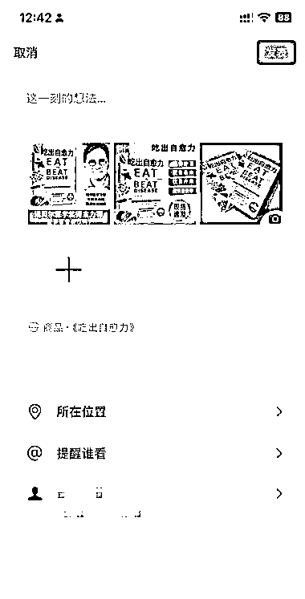

# 微信生态流量红利：小店商品可分享至朋友圈，多产品关联加速布局

> 原文：[`www.yuque.com/for_lazy/wind/tmlyoug6ebvpi5g6`](https://www.yuque.com/for_lazy/wind/tmlyoug6ebvpi5g6)

作者： Eamon

日期：2025-09-30

点赞数：**20**

* * *

正文：

微信小店商品可以分享到朋友圈了。 最近也在观察，视频号、公众号、问一问等等产品，微信一直在打通整体生态下的关联，已经很健全了。
感觉也是一个信号，基于微信的流量，早进入早吃初期红利。

* * *

评论区：

亦仁 : 感谢分享，已中标

* * *

公众号懒人搜索，[懒人专属群分享](https://lazybook.fun/#/blog/group)