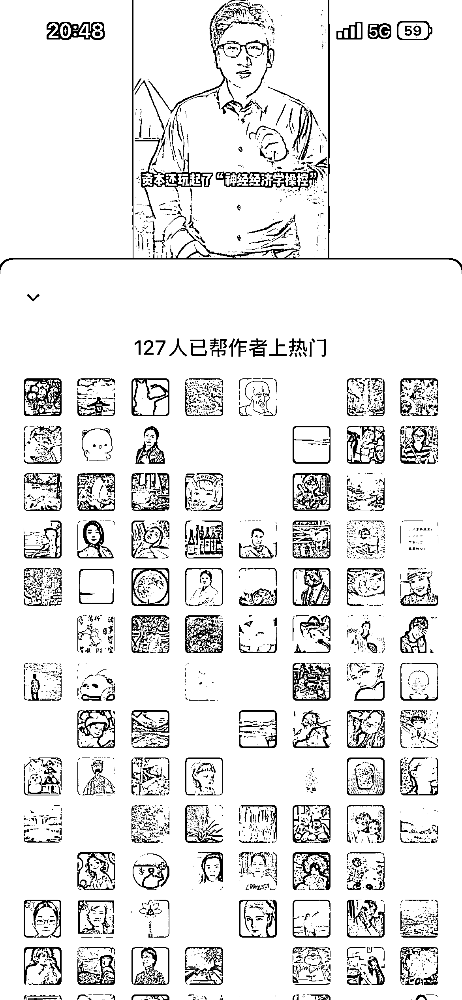
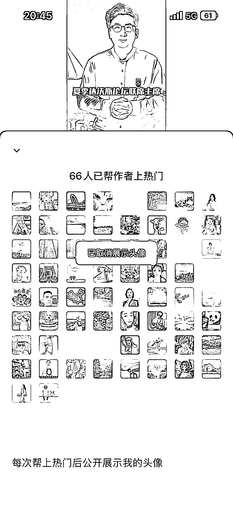
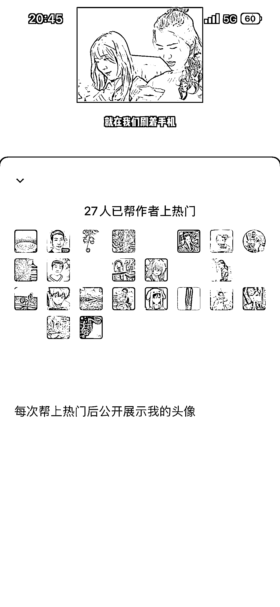
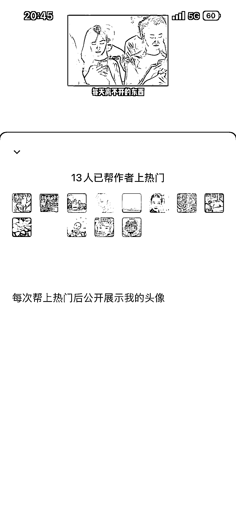
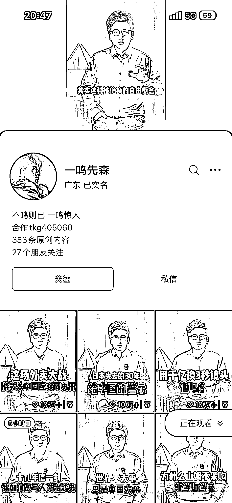
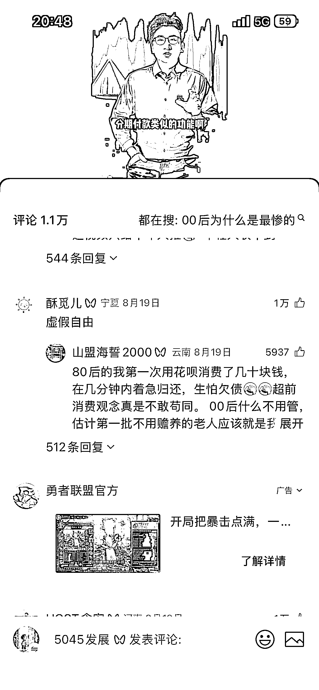
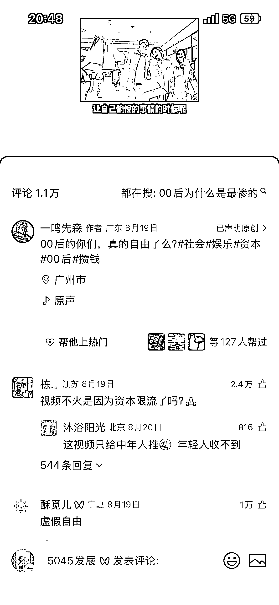

# 观众助推热门背后的创作者变现与个人商业 IP 拓展方向探析

> 原文：[`www.yuque.com/for_lazy/wind/twgx3f64ie8gb96u`](https://www.yuque.com/for_lazy/wind/twgx3f64ie8gb96u)

作者： 朱百万

日期：2025-10-09

点赞数：**20**

* * *

正文：

发现一个异常值。观众帮博主上热门，这个动作是绝对认可的。毕竟是观众花钱帮博主上热门，这视频或是底层逻辑值得深究。有兴趣的可以自己去发掘，变现有创作者变现，个人商业 Ip，接商广等拓展的方向挺多

* * *

评论区：

亦仁 : 感谢分享，已中标

* * *

公众号懒人搜索，[懒人专属群分享](https://lazybook.fun/#/blog/group)