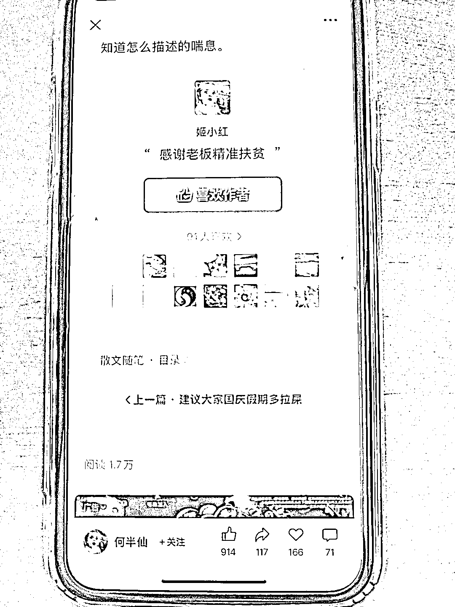
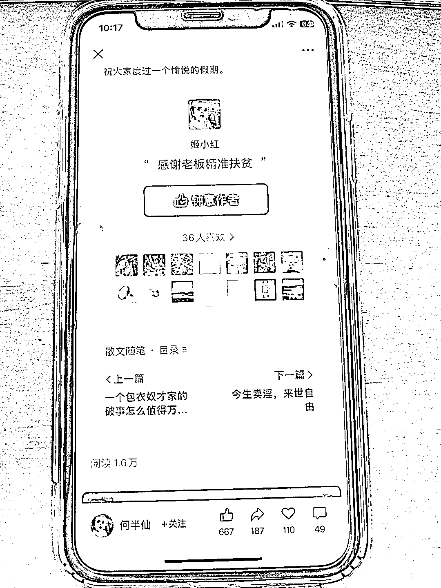
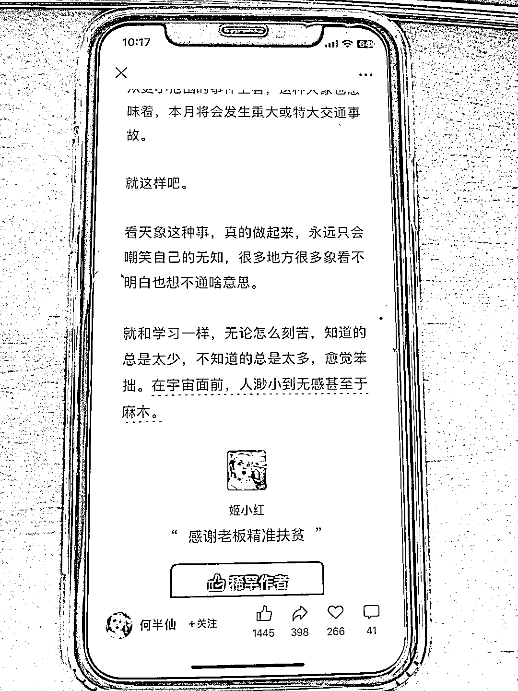

# 公众号文章稳定流量下的高打赏现象：单篇打赏人数数十至百人，阅读量数千到一两万

> 原文：[`www.yuque.com/for_lazy/wind/whmdwchyy40gr87u`](https://www.yuque.com/for_lazy/wind/whmdwchyy40gr87u)

作者： 朱百万

日期：2025-10-09

点赞数：**37**

* * *

正文：

发现一个公众号异常值，图片里是他的最近几天文章。基本篇篇文章都有人打赏，他的每篇文章打赏人数少则几十人，多则上百人。流量挺稳定几千到一两万居间。有兴趣的可以去深入了解

* * *

评论区：

cherry : 看了下，大抵确实是文笔好！

杨爽@生财有术 : 其实是打赏=知识星球的费用，打赏满 300，才有资格付费 50 加入星球。星球目前的付费人数是 2000+

cherry : [强][强][强]又学到了

亦仁 : 感谢分享，已中标

* * *

公众号懒人搜索，[懒人专属群分享](https://lazybook.fun/#/blog/group)