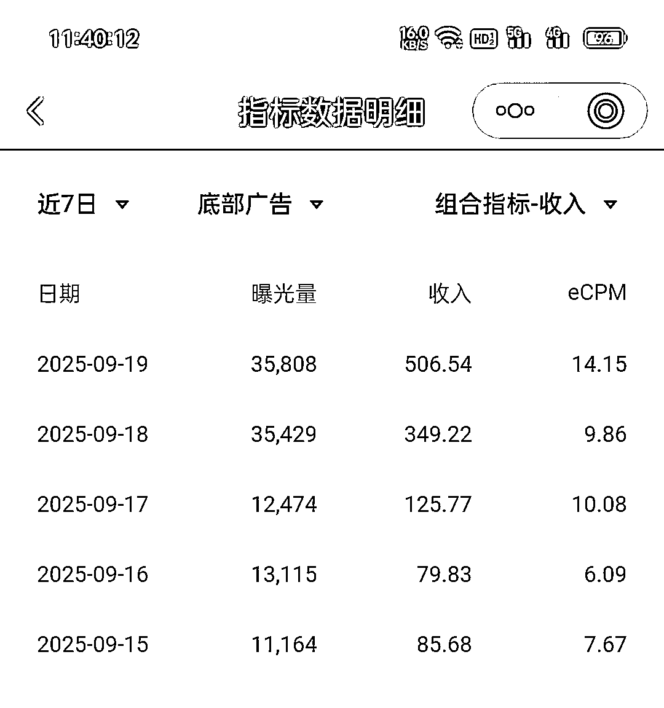
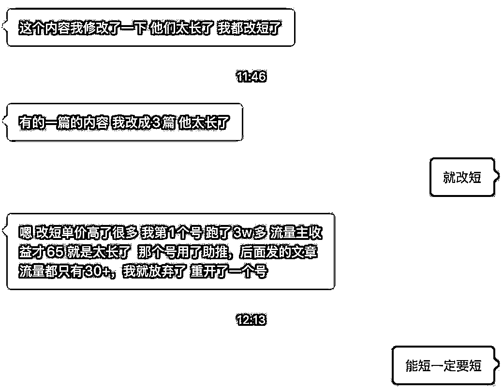

# 公众号中老年人赛道流量主变现玩法

> 原文：[`www.yuque.com/for_lazy/wind/gf8yg9fr8ae6exkq`](https://www.yuque.com/for_lazy/wind/gf8yg9fr8ae6exkq)

作者： 馆主

日期：2025-09-28

点赞数：**33**

* * *

正文：

变现｜异常值 公众号-中老年人赛道—流量主变现（异常值） 公众号邪修玩法： 1/注册账号（不需要养号，注册完明天就可以开干）
2/刷 500 粉丝（找刷手—刷粉丝） 3/开通流量主（3 个广告开满） 4/制作内容（AI 生成） 流量主的广告主要分为三个：文中广告、底部广告、评论区广告
所以在写内容的时候，内容尽量要短篇，这样才能完美的让用户观看这三个广告，也能增加文章的完播率 ps：文章内容能短就要短篇的，流量主收益才高

* * *

评论区：

亦仁 : 感谢分享，已中标

* * *

公众号懒人搜索，[懒人专属群分享](https://lazybook.fun/#/blog/group)