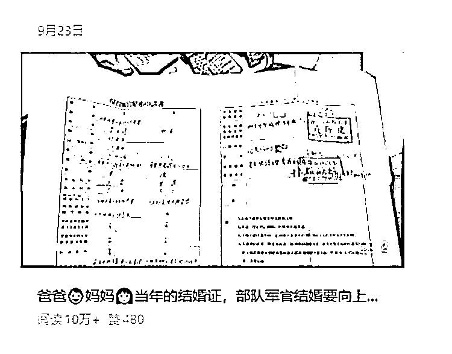

# 公众号怀旧内容 老结婚证 10 万+爆款拆解与创作指南

> 原文：[`www.yuque.com/for_lazy/wind/wx29bypsqhd1db10`](https://www.yuque.com/for_lazy/wind/wx29bypsqhd1db10)

作者： 云珞 YunL

日期：2025-09-30

点赞数：**14**

* * *

正文：

一句话，二张图，有 10 万+爆款，这张老结婚证能成 10 万 +
爆款，一方面是它承载着父母辈的爱情与时代记忆，容易引发经历过那个年代的人共鸣；另一方面，部队军官婚姻的特殊流程自带故事性，满足了大众的好奇心，唤起大家对过往岁月里情感与制度的关注，从而带来高传播量。
如果想做这类怀旧公众号：1、：除了老结婚证这类物件，还可以关注老照片、旧书信、老物件背后的故事等，比如分享爷爷奶奶的家书、
改革开放初期的家庭老照片等，引发读者对过去时光的怀念和共鸣。可以定期推出 “怀旧特辑”，征集读者的老物件故事，增强与读者的互动。
：继续关注军人、教师、医生等特殊职业群体在生活中的特殊经历、情感故事。例如，推出 “军人家庭的变迁”
系列文章，讲述不同年代军人家庭的生活方式、爱情故事；或者 “教师的独家记忆”，分享教师职业生涯中难忘的学生和教学经历等。
：将怀旧元素或特殊群体故事与当下热点结合。比如在情人节时，推出 “过去的爱情”
专题，讲述父母辈、祖父母辈的爱情故事，对比当下的爱情观；在退伍季，分享退伍军人的结婚故事、家庭生活等，增加内容的热度和关注度。

* * *

评论区：

亦仁 : 感谢分享，已中标

* * *

公众号懒人搜索，[懒人专属群分享](https://lazybook.fun/#/blog/group)