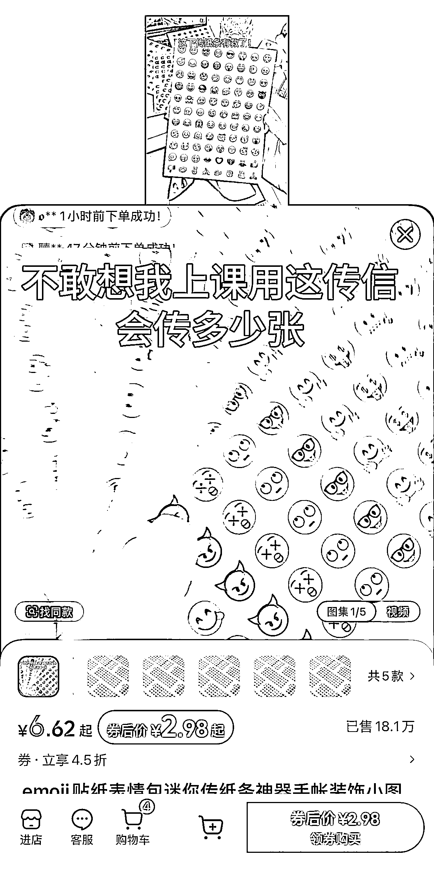
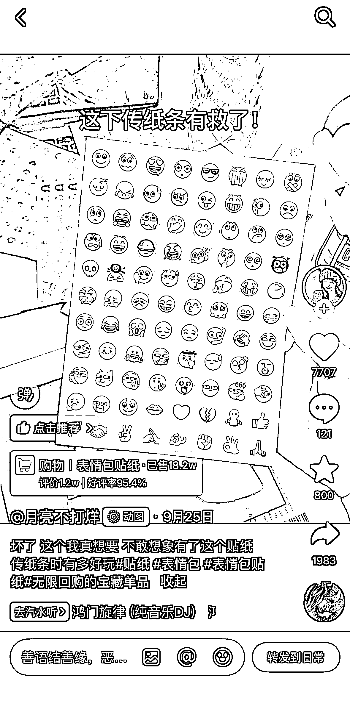
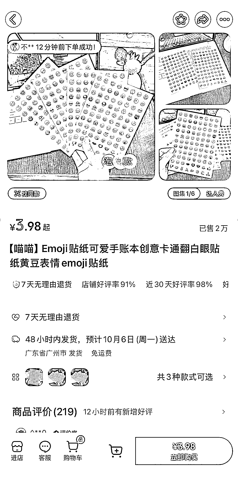
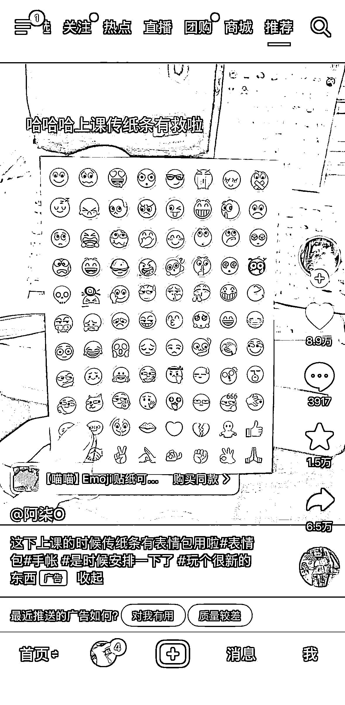

# 抖音表情包贴纸 20w 单销量拆解：教室办公场景下的低成本爆款商品

> 原文：[`www.yuque.com/for_lazy/wind/isb1ab2pgxbplsiv`](https://www.yuque.com/for_lazy/wind/isb1ab2pgxbplsiv)

作者： 馆主

日期：2025-10-03

点赞数：**32**

* * *

正文：

产品｜异常值 在抖音上刷到一个商品卖的很火，emoji 表情包帖纸，售卖数量 20w 单（异常值） 至于为什么会火爆呢？
因为在（学校）教室里面/（公司）工作上，需要使用到纸条传递信息的时候，可以把这个表情包帖到纸条上面，增加抽象感
其实这个商品制作过程非常的简单，需要具备以下条件：A4 帖纸、微信表情包，打印机 然后使用 PS/搞定把表情包排版到 A4 纸上，然后使用打印机进行打印机出来
作品也很简单，手拿几张 emoji 帖子录个视频发布就行了 这个商品同样可以迁移到小红书上售卖

* * *

评论区：

亦仁 : 感谢分享，已中标

* * *

公众号懒人搜索，[懒人专属群分享](https://lazybook.fun/#/blog/group)