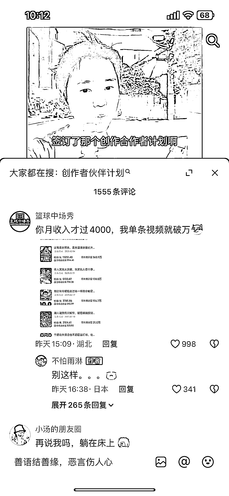
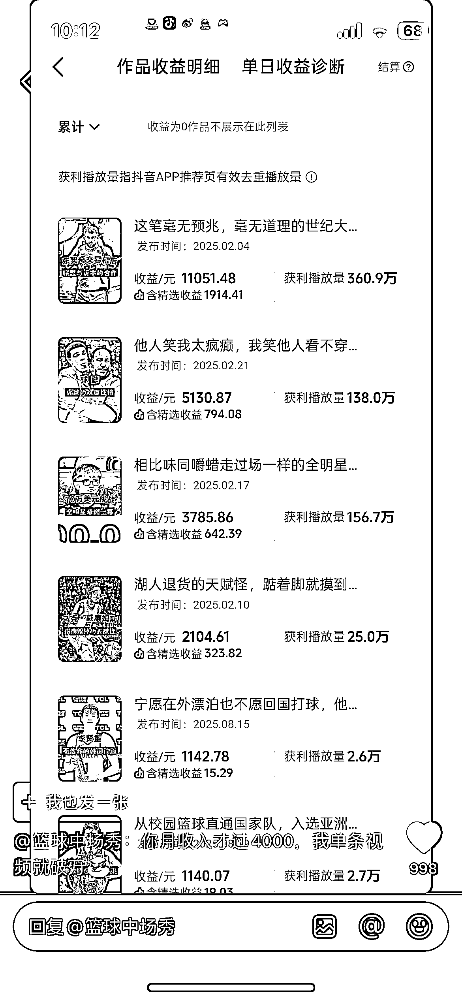
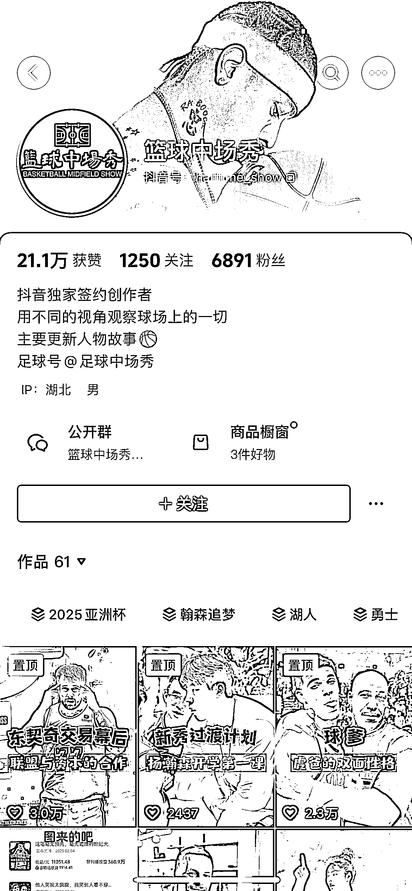

# 抖音垂直领域内容创作：兴趣事件可反复发布的运营思路

> 原文：[`www.yuque.com/for_lazy/wind/gv379bbabs1ekgcz`](https://www.yuque.com/for_lazy/wind/gv379bbabs1ekgcz)

作者： 李小胖

日期：2025-09-30

点赞数：**29**

* * *

正文：

抖音创作者伙伴计划——垂直人群的内容 抖音评论区捡到的一个账号，他做的是篮球类的
我发现我现在做账号就喜欢做泛一点的，感觉流量大。从他这个账号来看，垂直的账号，兴趣领域的一些事件，是可以反复发的
篮球的可以，足球的也可以，汽车的应该也是可以的

* * *

评论区：

翻斗花园 : 前两个月，我就看到抖音有人去做这种的，但是人家做的是收徒

MYX(爆单路上) : 这个是横屏和竖屏 都可以参加创作者伙伴计划？

MYX(爆单路上) : 门槛有点高： 1.主动申请（抖音端）：有效粉丝数需达到 5 万以上，且发布非广告类公开作品不少于 20 个。
2.中视频伙伴计划升级：若已加入中视频伙伴计划，可通过该渠道升级至创作者伙伴计划，需满足以下条件之一：有效粉丝数≥1 万，且自 2024 年 7 月 15
日起中视频创作收益＞0 元；有效粉丝数＜1 万，但中视频创作收益≥50 元，且需在规定时间内完成升级操作。

亦仁 : 感谢分享，已中标

山海 : 这个号只有几千粉就能加入创作者计划？

涿鹿中原 : 现在主流的的不是伙伴计划，是抖音精选

* * *

公众号懒人搜索，[懒人专属群分享](https://lazybook.fun/#/blog/group)