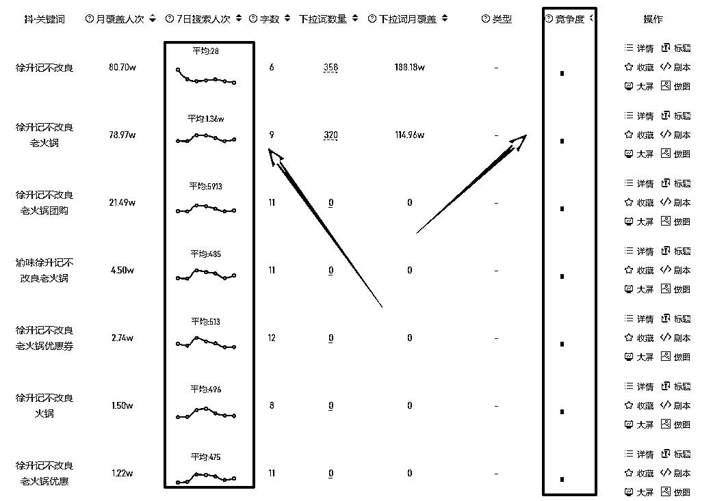

# 同城团购关键词搜索：高搜索人次低竞争度单品运营策略

> 原文：[`www.yuque.com/for_lazy/wind/iozk319svkxrk3nb`](https://www.yuque.com/for_lazy/wind/iozk319svkxrk3nb)

作者： 李小胖

日期：2025-09-30

点赞数：**26**

* * *

正文：

这是我在做闲鱼优惠券的时候，发现的一个品，特别适合做同城团购的关键词搜索
闲鱼当时几十个品，就这个一直有人问，一直出单。我就好奇查了一下抖音的同城搜索，这种单日搜索人次这么高，竞争度这么低的，属实是太罕见了
关键是，带货的同城博主很多，混剪素材，就足够使用了 而且同城博主基本不做搜索优化，稍微一优化， 就能起飞

* * *

评论区：

MYX(爆单路上) : - -哥，你这个优惠券 哪里进的货。

亦仁 : 感谢分享，已中标

* * *

公众号懒人搜索，[懒人专属群分享](https://lazybook.fun/#/blog/group)