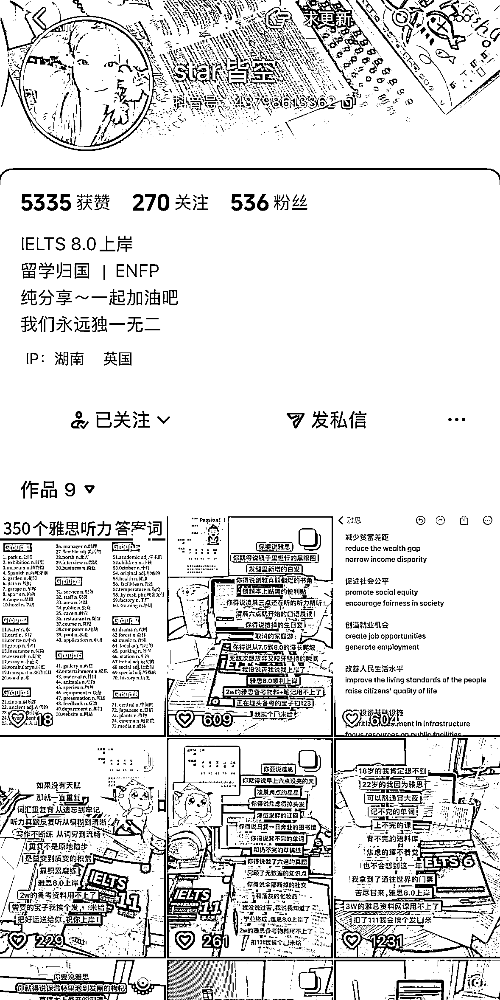
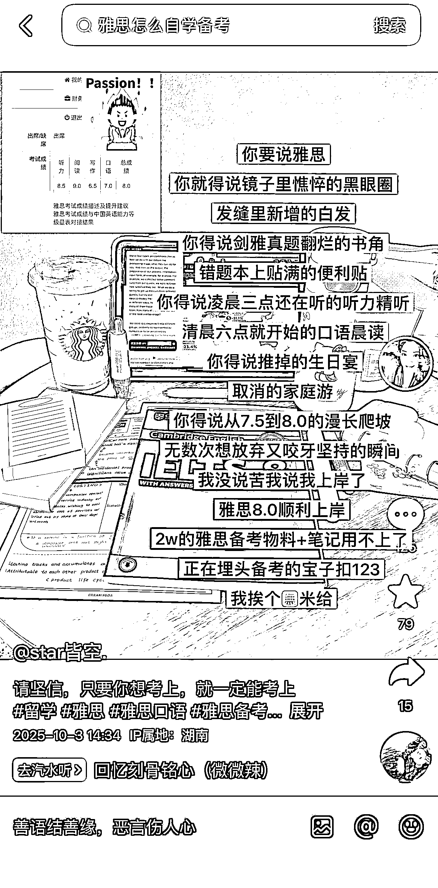
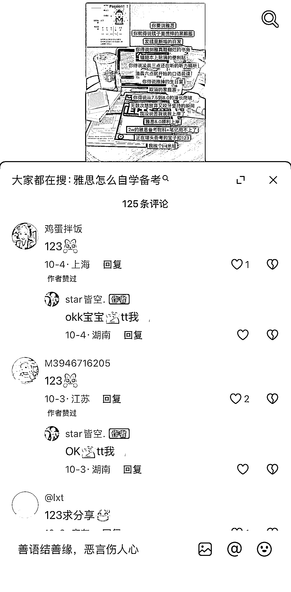
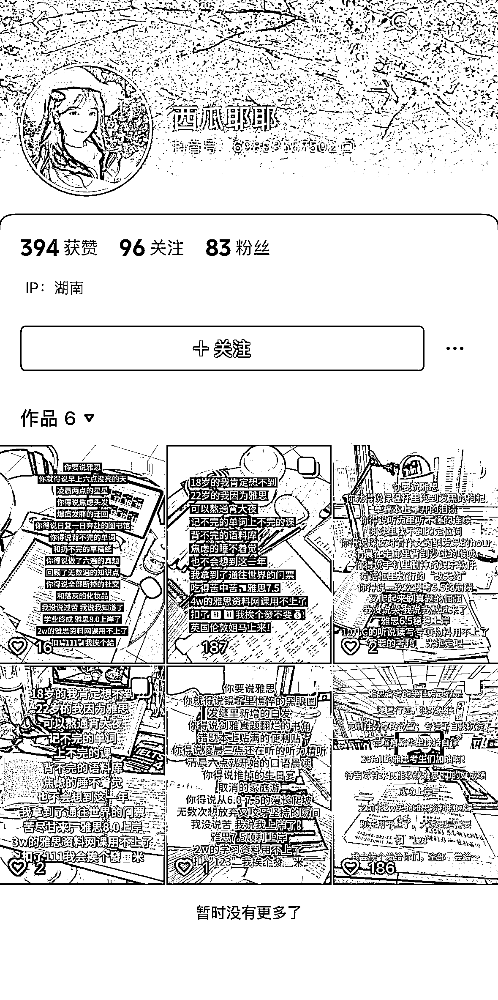
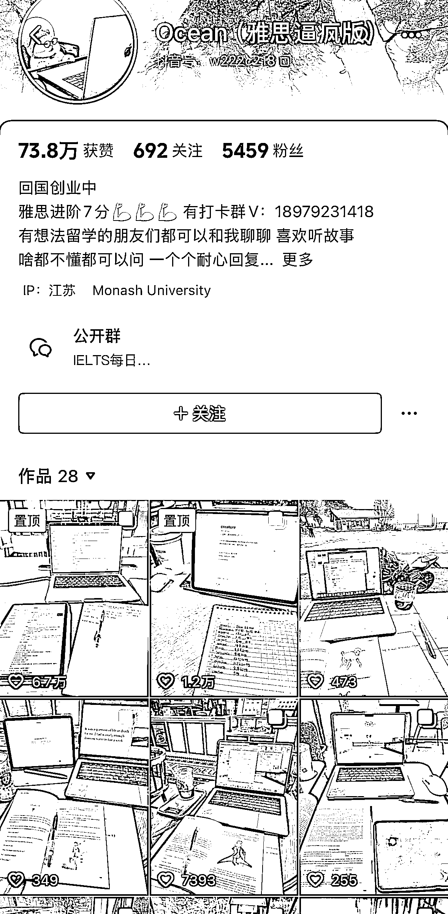
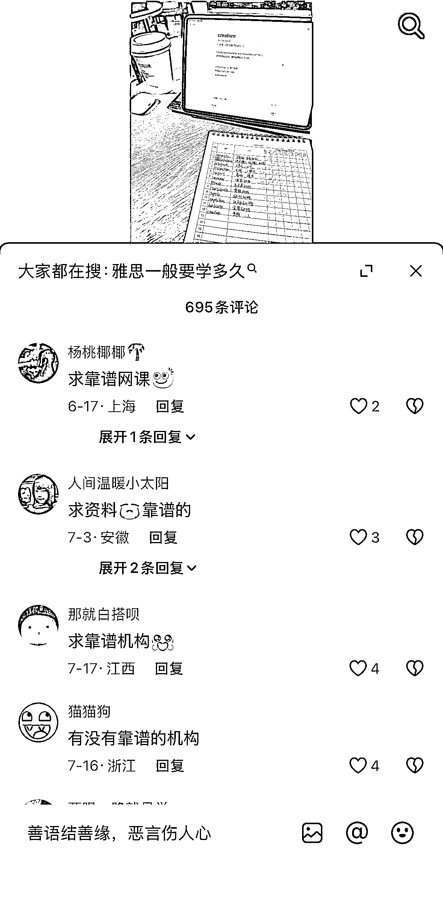
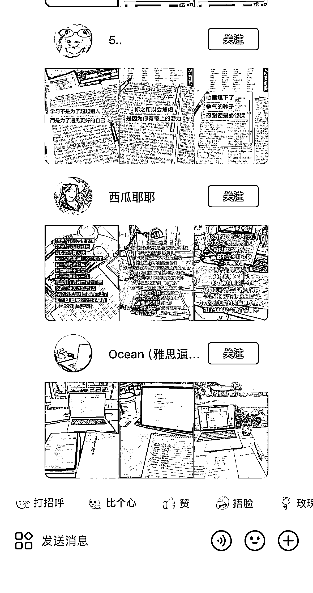

# 雅思英语赛道图文引流模板：关注 1000 个账号的大学生群体引流策略

> 原文：[`www.yuque.com/for_lazy/wind/yrt4itpdx7tvd9cq`](https://www.yuque.com/for_lazy/wind/yrt4itpdx7tvd9cq)

作者： 馆主

日期：2025-10-10

点赞数：**23**

* * *

正文：

需求｜异常值 在抖音上挖掘到一个非常火爆的【雅思英语赛道】图文引流模版，目前已关注 1000 个账号（异常值） 1/账号人群：大学生 2/细分赛道：雅思/考研
3/图文作品：这个模版非常的简单，一张写字桌加上摆放（平板电脑、杂七杂八的练习本、一本雅思练习手册）然后以手机的视角拍个照
我看了非常多的账号，他们的风格都是差不多的 观察评论区可以发现大量的用户在评论区发需求 通过这些用户需求，我深度的挖掘之后有以下几个引流；
1/领取雅思学习资料 2/求推荐【作者】同-雅思网课 3/求推荐｛作者｝同-雅思机构
我私信作者加微信后发现，领取资料这个路径，先低价售卖虚拟资料，在高价转换网课 其他的是直接推荐网课

* * *

评论区：

亦仁 : 感谢分享，已中标

* * *

公众号懒人搜索，[懒人专属群分享](https://lazybook.fun/#/blog/group)