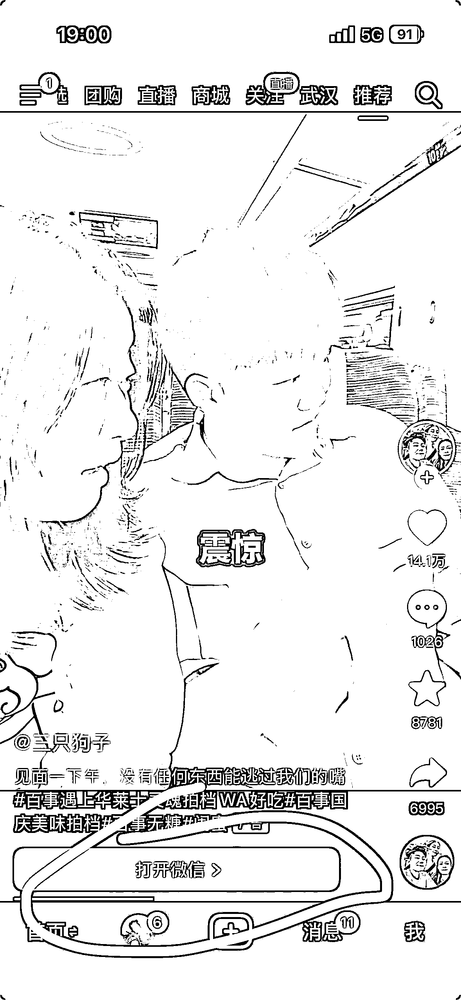
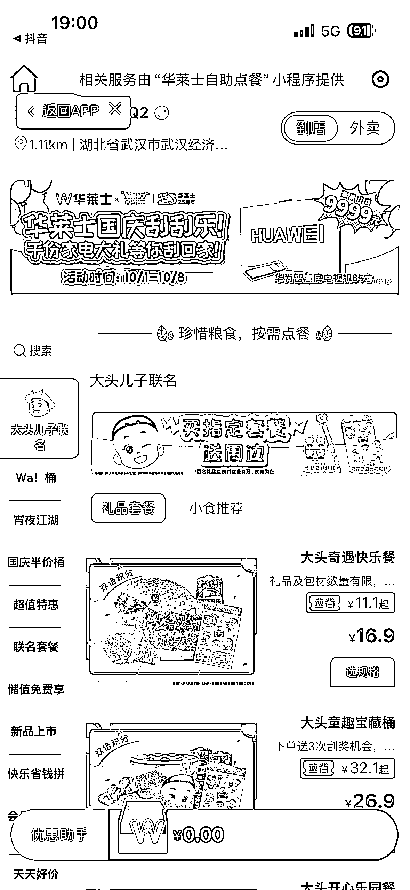

# 抖音企业号与微信小程序打通：转化链路缩短体验指南

> 原文：[`www.yuque.com/for_lazy/wind/pvl8rb1vq67voz5g`](https://www.yuque.com/for_lazy/wind/pvl8rb1vq67voz5g)

作者： Jack

日期：2025-10-03

点赞数：**20**

* * *

正文：

抖音和微信小程序打通，意味着转化链路缩短，有在做抖音企业号的圈友可以体验下

* * *

评论区：

亦仁 : 感谢分享，已中标

松原 : 这是付费广告，一直可以

* * *

公众号懒人搜索，[懒人专属群分享](https://lazybook.fun/#/blog/group)