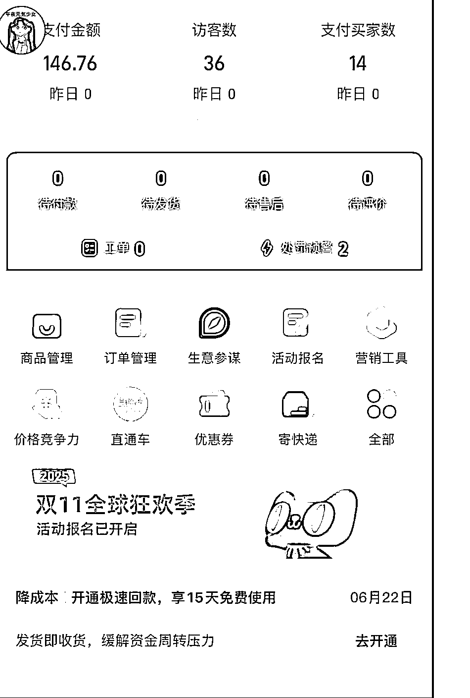

# AI 视频工具热点下的多渠道变现方向指南

> 原文：[`www.yuque.com/for_lazy/wind/gp97o3rifb1tmlo4`](https://www.yuque.com/for_lazy/wind/gp97o3rifb1tmlo4)

作者： 良辰美

日期：2025-10-01

点赞数：**28**

* * *

正文：

sora2 的机会无穷无尽 1. 做网站 2\. 做视频 3\. 写文章 所有的自媒体渠道，全球都是热点 赚钱的方式 按照性价比来说 1.
youtube 视频渠道大于其他 2\. 网站 saas 大于导航 3\. 文章公众号大于其他 用户直接付费大于广告费 同时还有一些奇技淫巧
比如，建立社群收费，比如 gumroad 卖 比如给别人定制视频，比如淘宝咸鱼小红书 sora 热点赚钱应对手册
pollo 这种几百万的大网站会慢一拍他们也会很快上线的 把 sora2 水印去除做出来也是一个巨大的机会
老照片修复，又可以重新做一遍了生日祝福，结婚祝福，奥特曼祝福 App Store 开发者的动作 和以往的爆款模型类似，Sora 2
一出现，就立刻被全球独立开发者盯上。不同开发者通过在 App Store
上架工具类应用，借助关键词覆盖来抢流量，因为开发者的反应速度直接决定了流量红利的归属。你能清晰看到一个关键词战场： Sora 2 - AI Video
Generator —— Mircan Girgin Cora 2 - AI Video —— Suna Qrreader Sorra 2 - Video
AI Generator —— Yusuf Horoncu Sora II - AI Video Generator —— Utku Gönlübol
圈友们赚钱了记得回来打赏！

* * *

评论区：

邓瑜 : 有种遍地是黄金的感觉[呲牙][偷笑]

亦仁 : 感谢分享，已中标

* * *

公众号懒人搜索，[懒人专属群分享](https://lazybook.fun/#/blog/group)