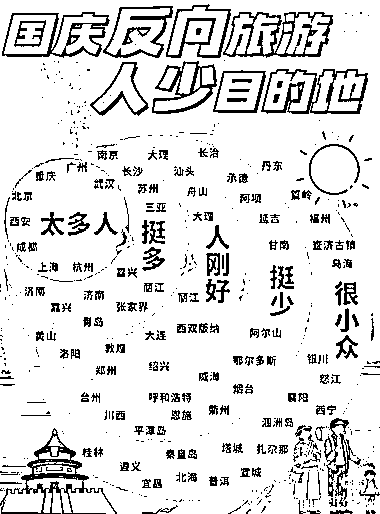
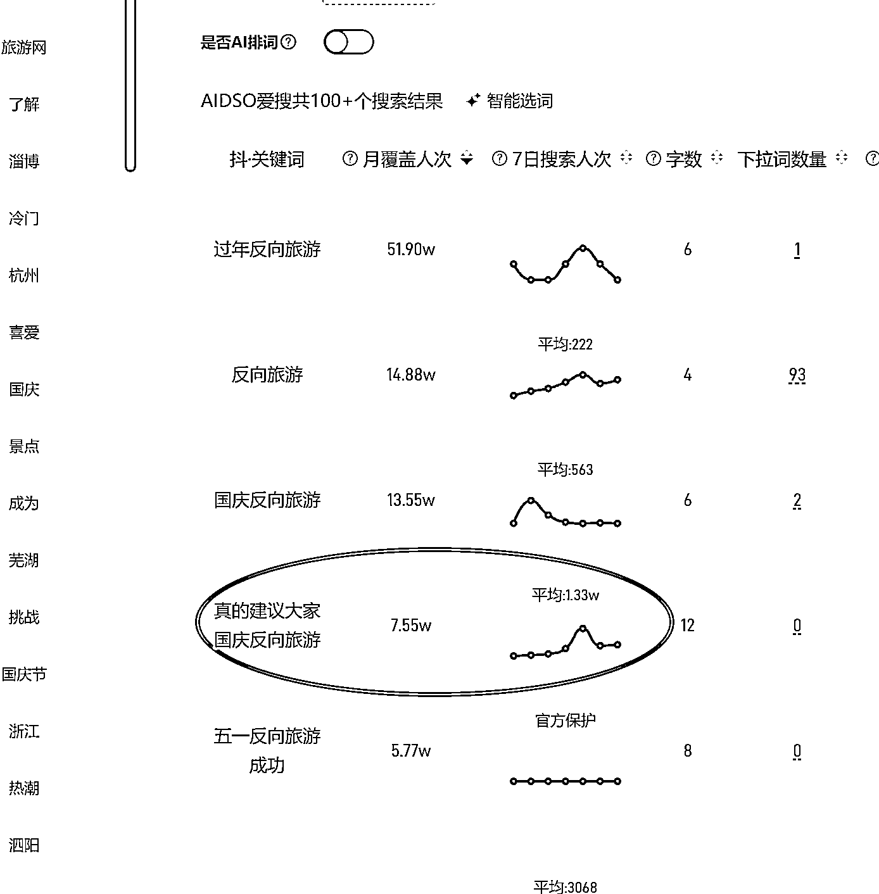
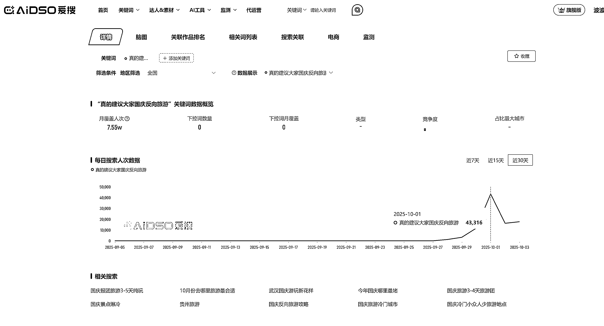
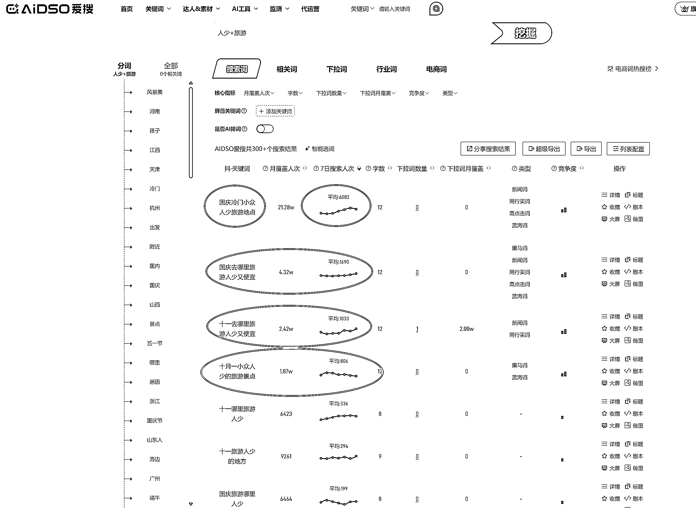

# 反向旅游赛道国庆热度攀升 年底或迎爆发增长

> 原文：[`www.yuque.com/for_lazy/wind/qzgdvfwoh55ty72z`](https://www.yuque.com/for_lazy/wind/qzgdvfwoh55ty72z)

作者： 波波

日期：2025-10-04

点赞数：**76**

* * *

正文：

反向旅游这个词国庆小爆一次，年底估计会继续爆，很有可能大爆一次！ 推荐产生兴趣，搜索反映需求。 用户的旅游需求正在发生改变。 机会也孕育于此！

* * *

评论区：

威@任我行 : 怎么操作

AntonyE/ac* : 国内用什么搜，百度吗

波波 : 用爱搜看的数据

波波 : 用爱搜看的数据

波波 : 可以作为内容的选题，临近假期的时候！

范师傅 : 桂林太惨了，已经沦为小众旅游地[破涕为笑]

.v : 真的很少人吗，我觉得不至于吧[流泪]

Sense : 刚从兰州 银川回来[微笑]

* * *

公众号懒人搜索，[懒人专属群分享](https://lazybook.fun/#/blog/group)