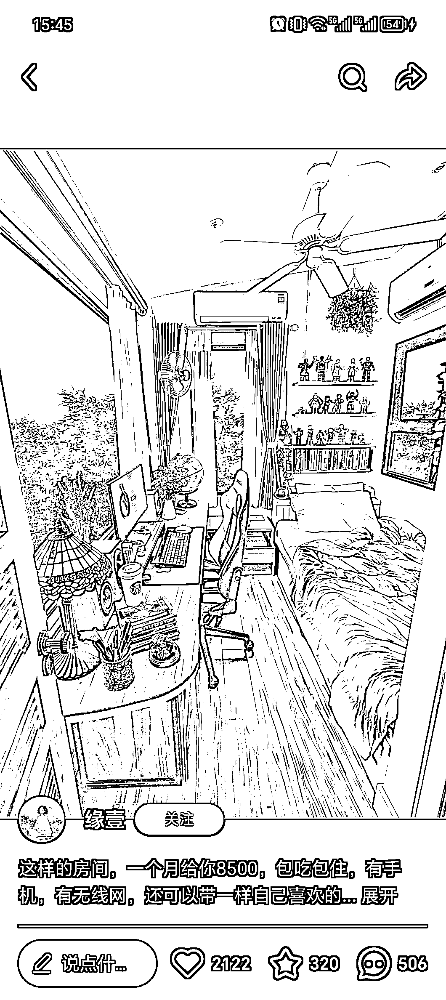
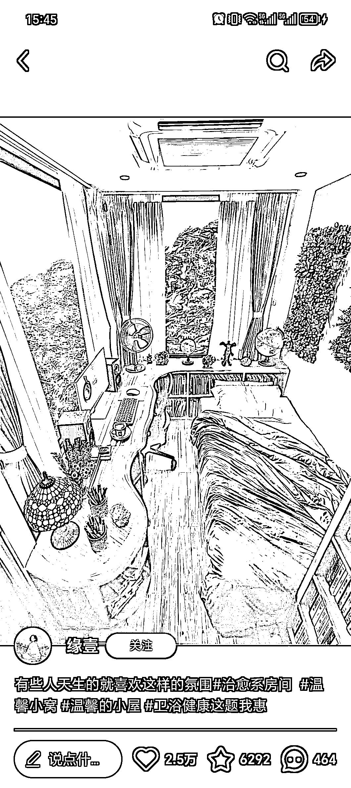
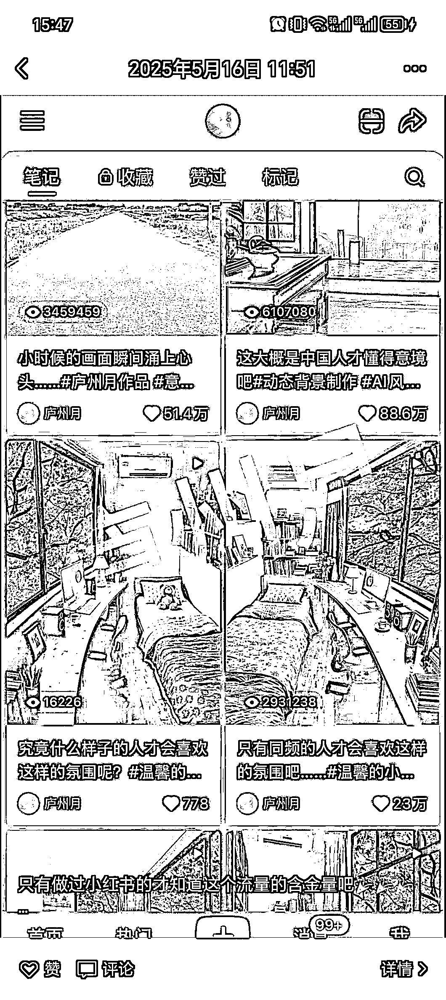

# AI 治愈系视频内容创作：高流量变现思路与平台收益策略

> 原文：[`www.yuque.com/for_lazy/wind/bucpdmcx75rbcbll`](https://www.yuque.com/for_lazy/wind/bucpdmcx75rbcbll)

作者： 拾壹贰

日期：2025-10-10

点赞数：**28**

* * *

正文：

在小红书上，无意间刷到这个笔记，数据非常炸裂。点开之后，第一反应是很舒服的，实际上整体是由 AI 制作，但是视频呈现的效果非常棒，再配上有争议性的话题，流量很炸裂。看图三，基本上有千万百万可以结合这这个思路，利用 AI 技术结合自己的赛道去增加流量，尤其是产品又美观，让人有治愈性的感觉.
这种账号可变现方式可以是收徒，可以是赚取平台的播放收益。小红书视频号，抖音都有相关的账号在赚播放量。
换一个思路，这种炸裂的数据就是可以运用到自己的项目中。结核异常值，这里面的异常值有治愈系的感觉，让人很舒服，也可以用做一些黄金三秒

* * *

评论区：

亦仁 : 感谢分享，已中标

* * *

公众号懒人搜索，[懒人专属群分享](https://lazybook.fun/#/blog/group)