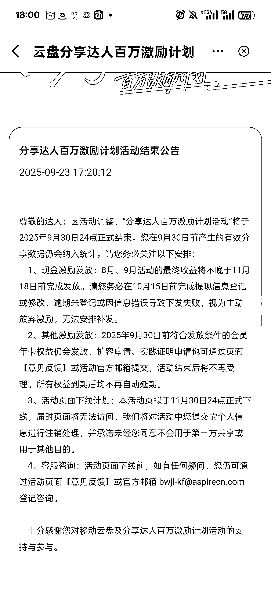
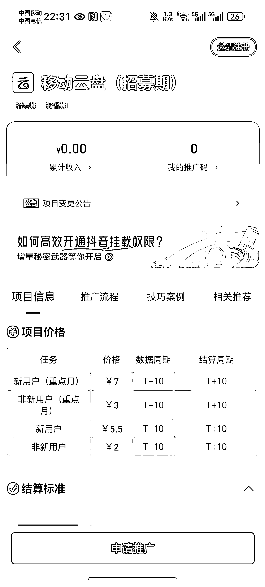

# 网盘拉新渠道 新用户单价 7 元 结算周期 T+10 天

> 原文：[`www.yuque.com/for_lazy/wind/sxn78zqq0w4vzidk`](https://www.yuque.com/for_lazy/wind/sxn78zqq0w4vzidk)

作者： 一网

日期：2025-10-09

点赞数：**30**

* * *

正文：

移动云盘拉新又开始了，单价 7 元，网盘拉新又多一个渠道！ 9 月份的时候移动云盘官方的拉新下线，很多人以为不能做了。（图 1）
这不，移动云盘把拉新的权限下放给网盘渠道商了，现在通过网盘就能推广移动云盘，新用户单价 5.5-7 元，非新用户 2-3 元。（图 2） 有几个重点说明一下：
1.重点月，2025 年 11 月，2025 年 12 月，2026 年 1 月，这三个月，新用户单价是 7 元，非新用户单价是 3 元，后面其他的月份新用户是 5.5 元，非新用户是 2 元；
2.结算周期是 T+10 天，这比原来移动云盘官方一个月结算要短很多。 3.同一个用户每个自然季度只做为新用户/老用户结算一次。
如果你做网盘拉新，移动云盘就是一个值得做的网盘，因为移动云盘市场占用率太低了，基本上分享资料出去，转存的用户都是新用户，就冲这点，它的拉新收益肯定是比较高的！
地址： [`dt.bd.cn/#/pages/index/components/detail?appId=1030&invite;_code=678678`](https://dt.bd.cn/#/pages/index/components/detail?appId=1030&invite;_code=678678)

* * *

评论区：

亦仁 : 感谢分享，已中标

* * *

公众号懒人搜索，[懒人专属群分享](https://lazybook.fun/#/blog/group)