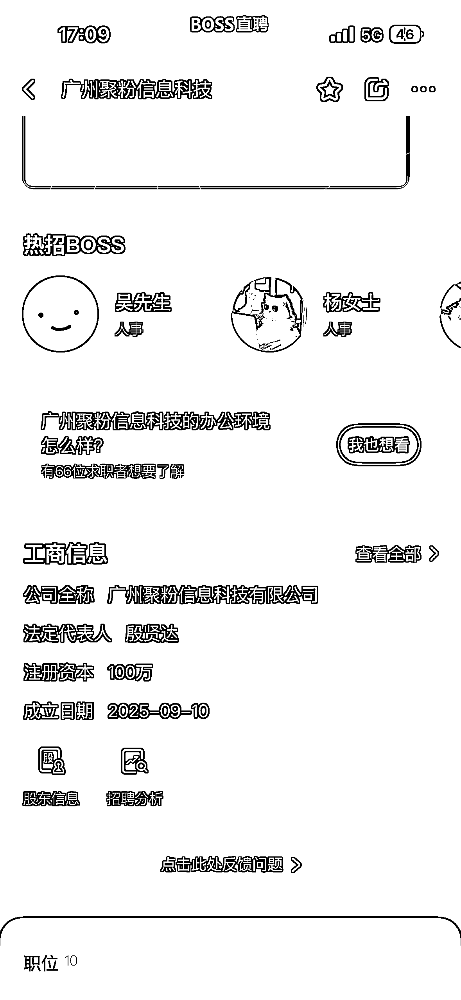
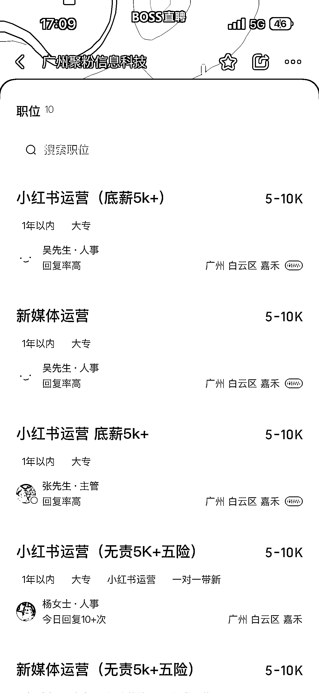
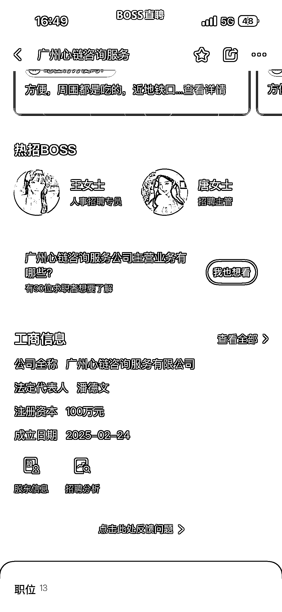
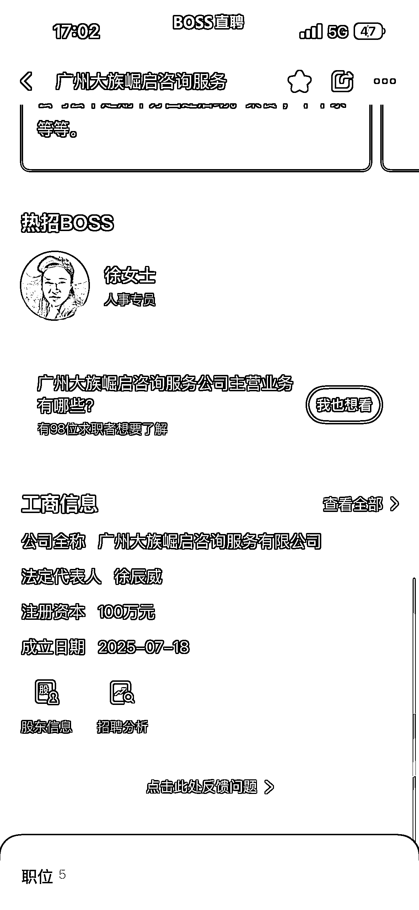
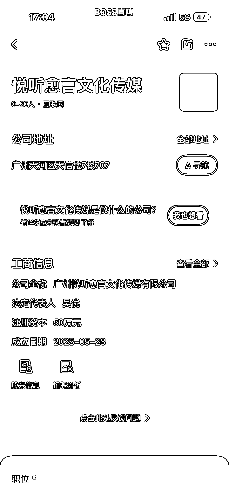
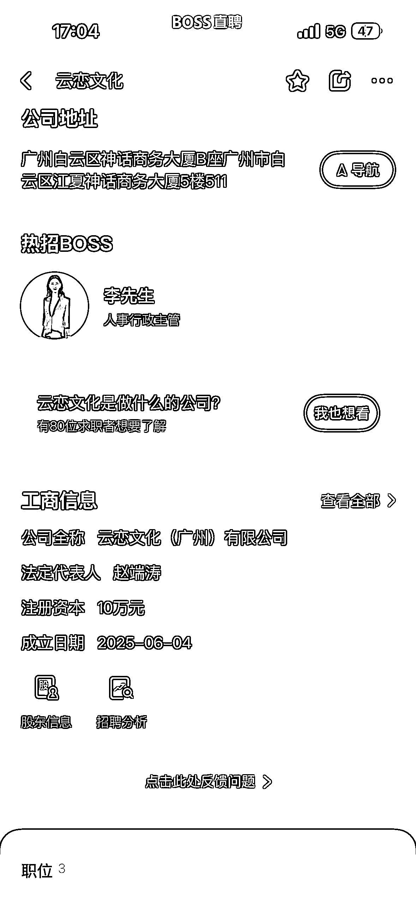

# 小红书情感咨询赛道：50 公里内 13 家新公司密集招聘信号解析

> 原文：[`www.yuque.com/for_lazy/wind/hd8u32hsdesvlka1`](https://www.yuque.com/for_lazy/wind/hd8u32hsdesvlka1)

作者： 馆主

日期：2025-10-10

点赞数：**22**

* * *

正文：

服务｜异常值 在 boss 上找工作发现一个异常赛道【情感咨询】，我刷了很多的小红书运营岗位，平台都是推荐这个赛道的岗位，在我附近的 50 公里就有 13 家
我挨个点进去看发现这些公司都是近期才注册的，这些公司投流去推广岗位信息流，这么着急的去招人，这是在释放什么信号🤔 我通过招聘岗位信息、公司简介、自媒体平台深度的挖掘得出以下项目路径： ·流量获取 ·客服承接 ·分配分析师销售 ·咨询师指导服务 ·咨询师续费持续指导
总觉：通过这些岗位信息，可以判断小红书非常适合做情感咨询，而且能够批量生产的引流模版出来了

* * *

评论区：

诗语 : 以前这帮人叫绅士摆渡、简爱咨询、让爱如偿所愿，都是十年前玩剩下的

馆主 : 是的，但是还是很赚钱，高客单，我私信问了一下 6000—17000¥左右

诗语 : 不算高，十年前去掉通货膨胀也是这个价位 真正高消费的是线下，现在主要割女生，收五万多，教的东西一模一样，就是换个性别 看了直摇头，这种女生用力过猛

馆主 : 好家伙，这么猛

亦仁 : 感谢分享，已中标

* * *

公众号懒人搜索，[懒人专属群分享](https://lazybook.fun/#/blog/group)