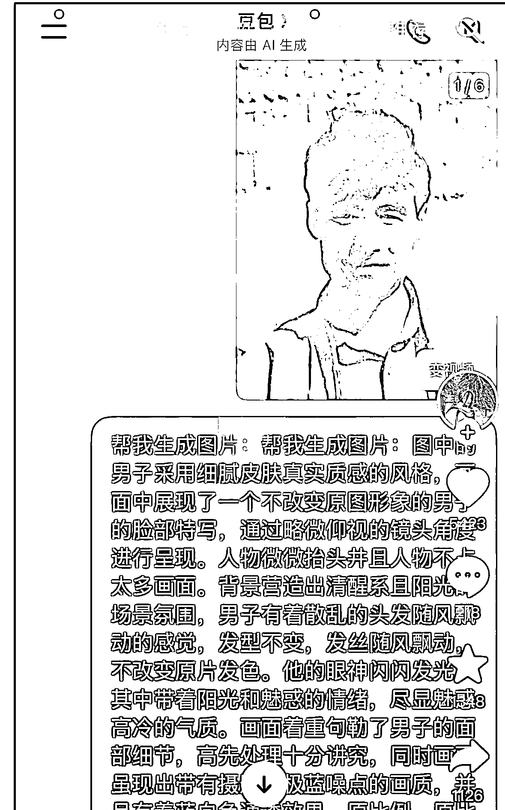
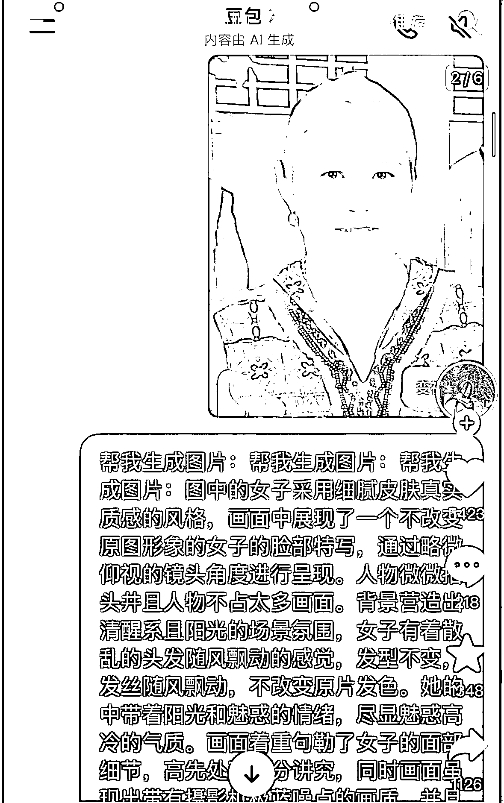

# 社交媒体提示词内容创作 低粉高赞高流量变现新方向

> 原文：[`www.yuque.com/for_lazy/wind/bclkmbpipitd0lhs`](https://www.yuque.com/for_lazy/wind/bclkmbpipitd0lhs)

作者： Chipen

日期：2025-09-30

点赞数：**18**

* * *

正文：

低粉高赞高流量的一种提示词风格。随着豆包等软件制图能力的提升，可以在抖音，小红书，X
等上面发更多类似的提示词效果内容，依旧是老照片的变种，以及其他旧模式的新变种，愿意尝试和获取提示词内容的用户很多，易于曝光和交互，甚至引导私域。账号也可以私域变现，也可以商单变现。

* * *

评论区：

亦仁 : 感谢分享，已中标

Chipen : 感谢亦仁[呲牙]

* * *

公众号懒人搜索，[懒人专属群分享](https://lazybook.fun/#/blog/group)