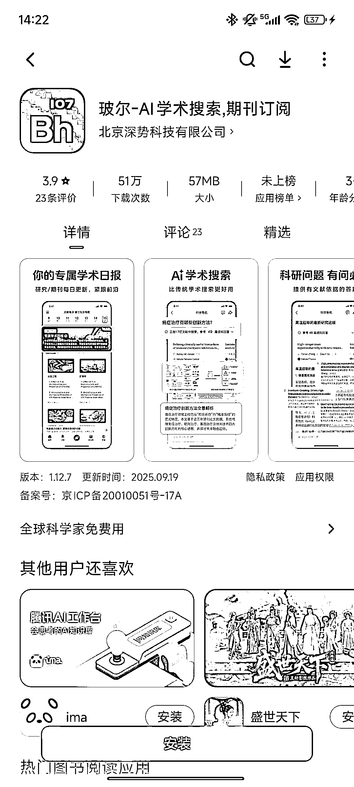
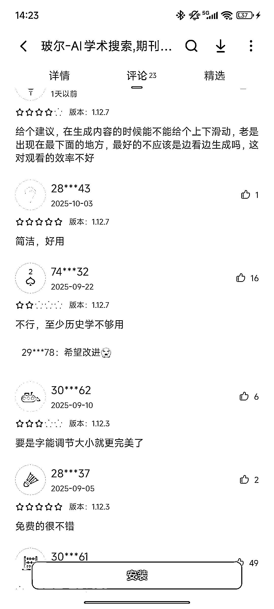

# 学术论文 AI 搜索工具开发：修复高频 BUG 开拓蓝海赛道

> 原文：[`www.yuque.com/for_lazy/wind/ekt6gtdykg0y0m5i`](https://www.yuque.com/for_lazy/wind/ekt6gtdykg0y0m5i)

作者： Leeka

日期：2025-10-10

点赞数：**22**

* * *

正文：

很有意思的一个 app 或小程序开发方向 专门针对学术论文做的 AI 搜索 这个软件 bug 比较多 咱用 AI 编程修复一下用户吐槽比较多的部分 就是一个蓝海方向了

* * *

评论区：

亦仁 : 感谢分享，已中标

* * *

公众号懒人搜索，[懒人专属群分享](https://lazybook.fun/#/blog/group)