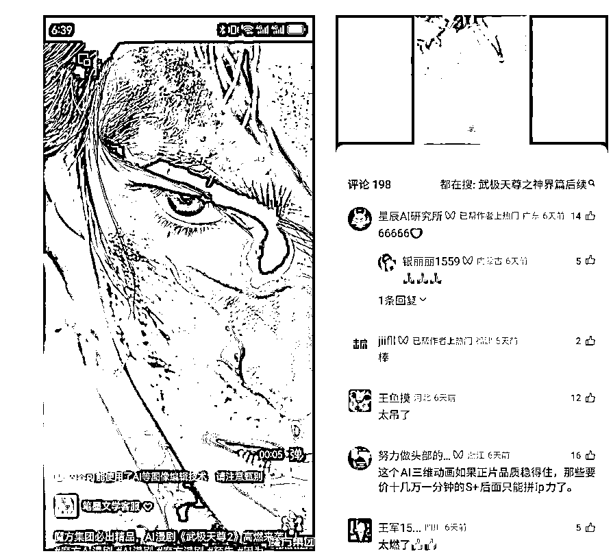

# 漫剧赛道爆发 Z 世代与一二线用户为主力 头部作品播放量超 7.4 亿 潜在用户规模超 2 亿

> 原文：[`www.yuque.com/for_lazy/wind/pqquc9xia3gwqgim`](https://www.yuque.com/for_lazy/wind/pqquc9xia3gwqgim)

作者： 漫鱼

日期：2025-09-30

点赞数：**14**

* * *

正文：

IP 表现数据​​ 漫剧市场正在爆发，Z 世代和一二线城市用户是主力，付费能力超强！真人短剧《武极天尊》累计播放量
​​4.5 亿​​，登顶 DataEye 短剧热力榜​​16 次​​；续作《武极天尊 2 之神界篇》播放量​​2.9 亿​​，抖音相关话题量超​​60 亿次​​。
《行道者之剑二十四》上线当天即登顶 DataEye 短剧热力榜。 ​​市场前景数据​​
2025 年被称作“漫剧元年”，动画微短剧双端（付费+广告）收入增长​​4-5 倍​​，供给量增长​​3 倍​​。
漫剧潜在用户规模超​​2 亿​​，由​​2.5 亿​​网文用户、​​6 亿​​真人短剧用户及​​4000 万​​漫画用户构成。 ​​用户画像数据​​
漫剧受众以​​Z 世代​​为主，​​30 岁以下​​用户占比超​​65%​​，​​一二线城市​​受众占比超​​60%​​，付费意愿与付费能力相对较高。
​​公司动态​​
魔方已规划“魔方 AI 漫剧宇宙”计划，除 AI 漫剧《武极天尊 2》外，其另一部 AI 漫剧《魔方帝尊》（改编自爆款短剧《魔方武帝》）已于​​2025 年 9 月 30 日​​上线。
​​战略目标​​ 魔方集团旨在从“爆款短剧制作方”升级为“​​AI 内容生态的构建者​​”。

* * *

评论区：

亦仁 : 感谢分享，已中标

漫鱼 : 谢谢老大😁

* * *

公众号懒人搜索，[懒人专属群分享](https://lazybook.fun/#/blog/group)